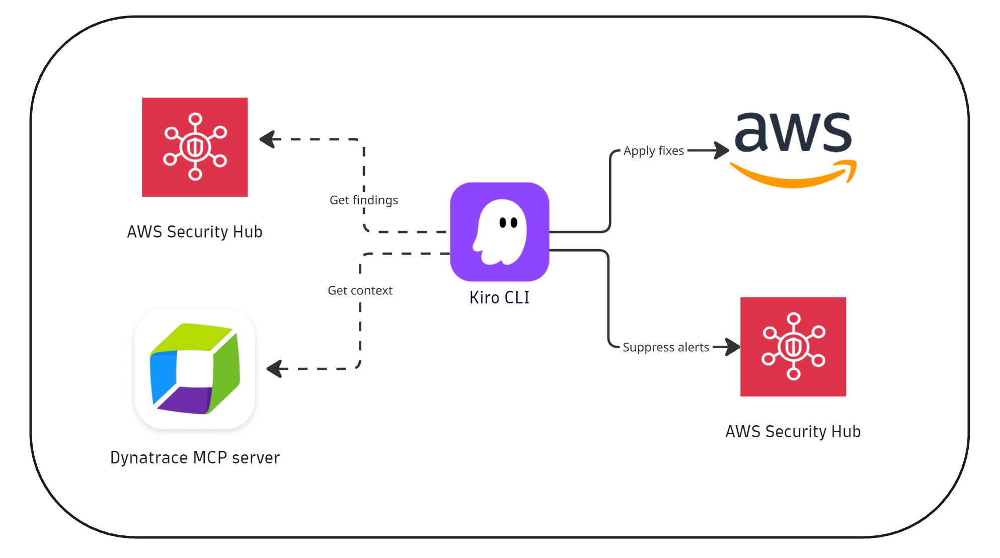
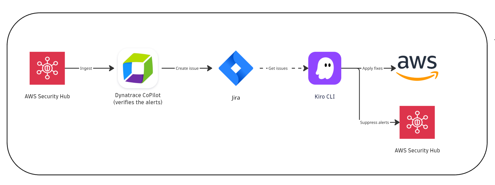

# Kiro CLI security agent

**Automate cloud misconfiguration triaging and remediation with Kiro CLI and Dynatrace.**

By integrating AWS Security Hub findings and Dynatrace insights, you can triage, validate, and remediate cloud misconfigurations right in the Kiro CLI.
This use case package provides all the essential artifacts and configuration required for deployment on both Kiro CLI and Dynatrace. 

Key features:
- AI-assisted cloud misconfigurations verification using Dynatrace runtime context.
- AI-assisted remediation of the misconfigurations.
- AWS Security Hub integration-based Jira ticket creation.

**Learn more and follow step-by-step instructions in the official documentation:**  
[Automate cloud misconfiguration triaging and remediation with Kiro CLI and Dynatrace](TBD)

**Scenario 1: Kiro CLI-based triaging**

**Scenario 2: Dynatrace-driven triaging**

